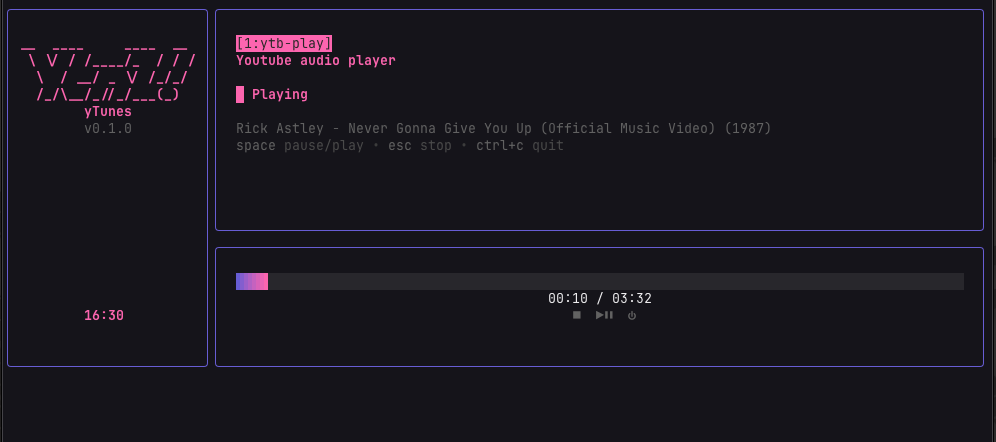

# Ytunes v.0.1.0



[](https://github.com/sina96/ytunes/actions/workflows/go.yml)
[](LICENSE)

A TUI audio player built in Go and [Bubble Tea](https://github.com/charmbracelet/bubbletea/tree/main). 

May you never leave your terminal again!

## About

`yTunes` plays audio from a YouTube URL, for now , in your terminal. Paste
a link, hit enter, and it plays through [mpv](https://mpv.io) with a
retro-styled Bubble Tea interface: transport controls, a live progress
bar, and a handful of built-in themes. 

This started as (and still is) a hands-on Go learning project. I also submitted it as my Capstone Project in [Boot.dev](https://boot.dev). I have used ai for discussing and brainstorming (and fixing the IPC socket because i am not so nerd yet) but most of the code has been generated by me.

Enjoy it with your theme choice! [dracula](https://github.com/dracula/dracula-theme), [gruvbox](https://github.com/morhetz/gruvbox), [Catppuccin](https://catppuccin.com/palette/) are included!

## Installation

**Requirements:** [mpv](https://mpv.io) and
[yt-dlp](https://github.com/yt-dlp/yt-dlp) must be installed and on your
`PATH` — `ytunes` shells out to both rather than bundling them (mpv and
yt-dlp are their own, separately licensed projects).

**Already have Go?**

```sh
brew install mpv yt-dlp   # macOS — or your system's package manager
go install github.com/sina96/ytunes@latest
```

This puts a `ytunes` binary in `$(go env GOPATH)/bin` — make sure that's
on your `PATH`.

**Don't have Go, or want it built from a local clone?** Run the install
script — it installs mpv/yt-dlp via your system's package manager
(Homebrew on macOS; apt, dnf, or pacman on Linux) if they're missing,
then builds and installs the `ytunes` binary:

```sh
./install.sh
```

Or do it by hand:

```sh
brew install mpv yt-dlp   # macOS
# or: sudo apt install mpv yt-dlp   (Debian/Ubuntu)

go build -o ytunes .
./ytunes
```

Flags: `--minimal` runs a compact, sidebar-free layout.

## Docs

- **[CHANGELOG.md](CHANGELOG.md)** — one-liner summary of what each
  development phase added.
- **[CONTRIBUTING.md](CONTRIBUTING.md)** — how to build/verify a change
  locally and what to expect from review.
- **[LICENSE](LICENSE)** — MIT.

## Known Issues
- **First pause Latency** — the first time you pause, there may be a noticeable delay before the pause is registered. Timer acts weird. as i said i got help from ai for ipc and i am not proud of it
- **Windows Support** —  Not supported yet. Sorry

## Upcoming features
- Bug fixes.
- Theme persistency.
- Better compact version
- Pixelated art?
- Youtube-dl support
- Soundcloud or spotify or local file play.
